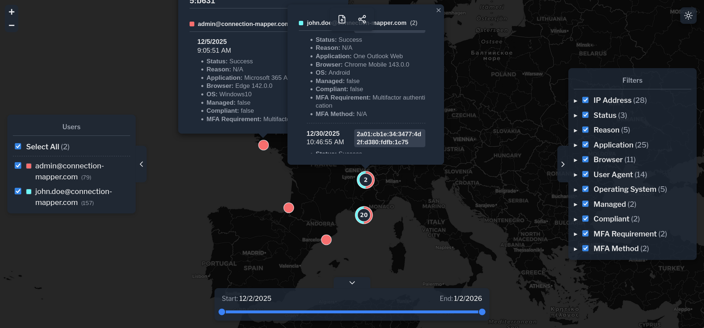
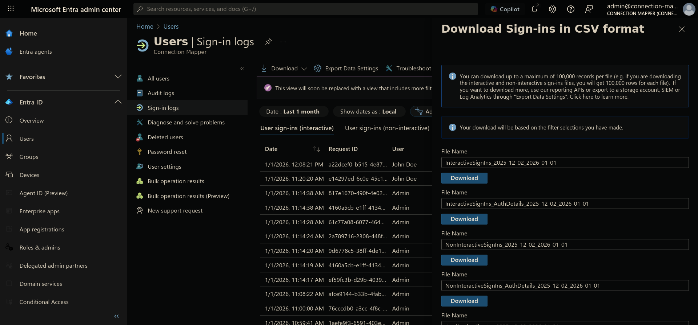
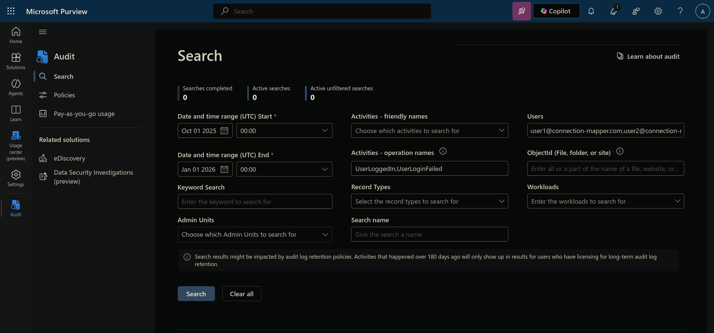

# Connection Mapper

<div align="center">

[](https://github.com/Eudaeon/connection-mapper/stargazers)
[](https://github.com/Eudaeon/connection-mapper/network)
[](https://github.com/Eudaeon/connection-mapper/issues)
[](LICENSE)

**A web application to visualize user sign-in locations from CSV logs on an interactive map.**

</div>

## 📖 Overview

This interactive application is designed to simplify the analysis of security logs by providing a visual overview of connection origins. It enables users to transform static CSV logs from Azure Sign-in or Purview Audit formats into an interactive geolocated map.

The application operates entirely in the browser, parsing local CSV data and geolocating IP addresses using [ip-api.com](https://ip-api.com/). It features a filtering engine that allows for real-time data slicing by user, time ranges, application, device properties, and more.

<div align="center">



</div>

Once a view is configured, users can generate a compressed URL to share the exact map state and geolocated data with others.

> [!WARNING]
> Browsers have a hard limit for URL lengths, often ranging from a few thousand to tens of thousands of characters. This limits the amount of data that can be shared via a link.

## 📦 Setup

### Installation

Clone the repository and install dependencies with:

```bash
git clone https://github.com/Eudaeon/connection-mapper.git
cd connection-mapper
npm install
```

### Serve

To start a local development server:

```bash
npm run dev
```

### Build

To type-check and build the application for production:

```bash
npm run build
```

## 🔧 Usage

Export your sign-in or audit logs as a CSV and click the "Upload" button in the top control bar to populate the interactive map.

### Azure Sign-in (up to 1 month)

Go to [Microsoft Entra ID Sign-in](https://entra.microsoft.com/#view/Microsoft_AAD_UsersAndTenants/UserManagementMenuBlade/~/SignIns). You can filter for a specific user or include all users, and adjust the date range as needed.

To export the data, click "Download", select "Download CSV", and choose the button located within the InteractiveSignIns section.

<div align="center">



</div>

### Purview Audit (up to 6 months)

Go to [Microsoft Purview Audit](https://purview.microsoft.com/audit). You may define your target users and set the operation names to `UserLoggedIn,UserLoginFailed` to reduce the CSV size.

While the application filters these automatically, narrowing the search here ensures that the exported CSV is smaller, and thus processed faster by the application.

<div align="center">



</div>

---

<div align="center">

**⭐ Star this repo if you find it helpful!**

Made with ❤️ by [Eudaeon](https://github.com/Eudaeon)

</div>
